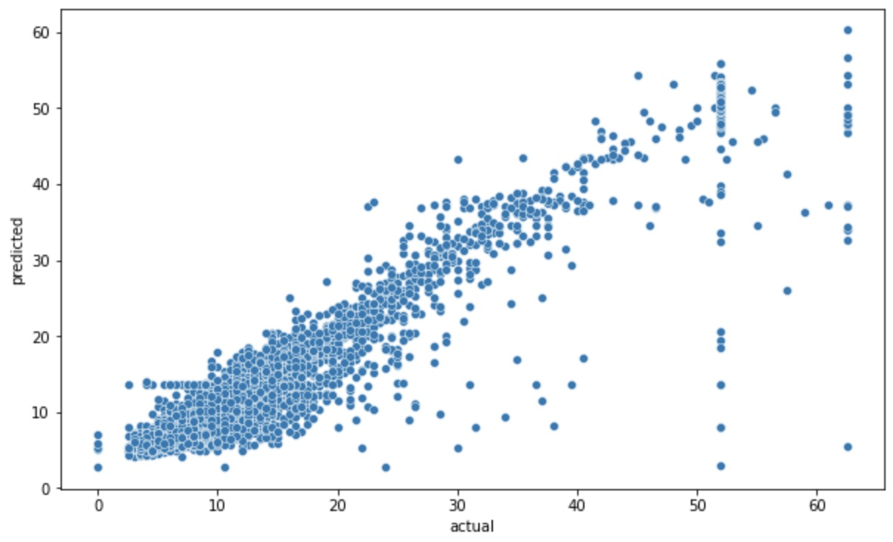

# taxi_fares_estimation
## Overview
This project was completed within Google Advanced Data Analytics Specialization. The goal was to develop a model for estimating taxi fares before a ride for the New York City Taxi and Limousine Commission (TLC). It involved analyzing a dataset provided by the TLC to understand key variables, explore relationships within the data, and build a predictive model. 

## Data Understanding
The TLC's dataset contains 22,699 entries with 18 columns, including information on pickup/dropoff locations and times, ride distances and durations, payment types, fare amounts, and tip amounts. The variables trip_distance and trip_duration were identified as relevant for the project. Exploratory data analysis showed a linear dependency between trip distance and total amount; although some rides had no distance, they still had fare amounts. 

## Model and Evaluation
A multiple linear regression model was built to estimate taxi fares, using trip distance and trip duration as independent variables. The model explains 84% of the variation in fare amount, indicating it is an effective predictor. When trip distance and duration are zero, the model predicts a base fare of $2.8106. The model estimates that the fare increases by $2.3389 per mile and $0.2414 per minute of trip duration.  

*the relationship between actual and predicted values using a testing dataset*
## Conclusion
The regression model developed in this project provides a useful tool for estimating taxi fares in New York City. The model demonstrates that trip distance and duration are strong predictors of fare amount. Recommendations for future work include exploring the addition of other independent variables, such as rush hour indicators, to potentially improve the model's accuracy. Additionally, the analysis suggests considering loyalty programs for long-distance riders, as distance and duration significantly impact fares. 
